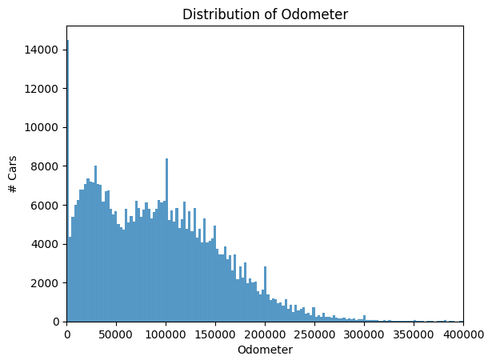
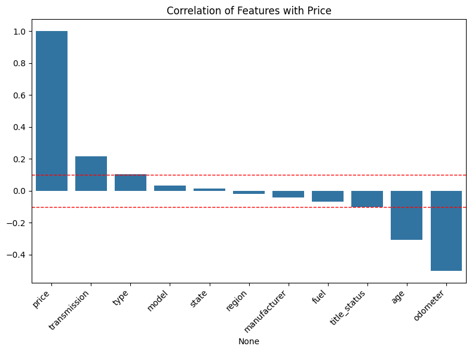
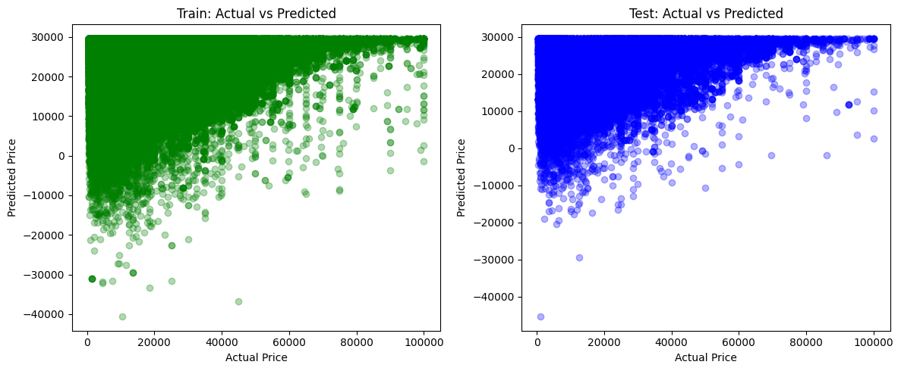
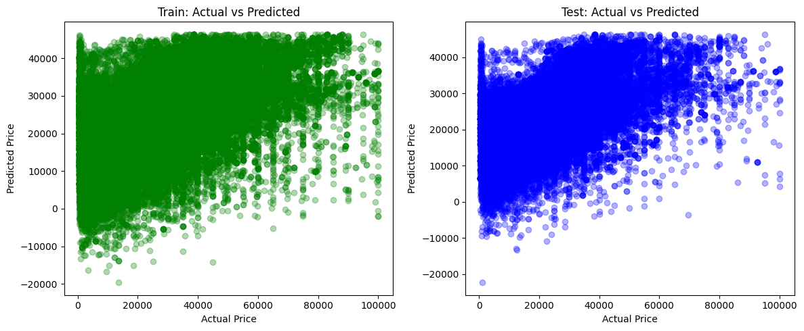
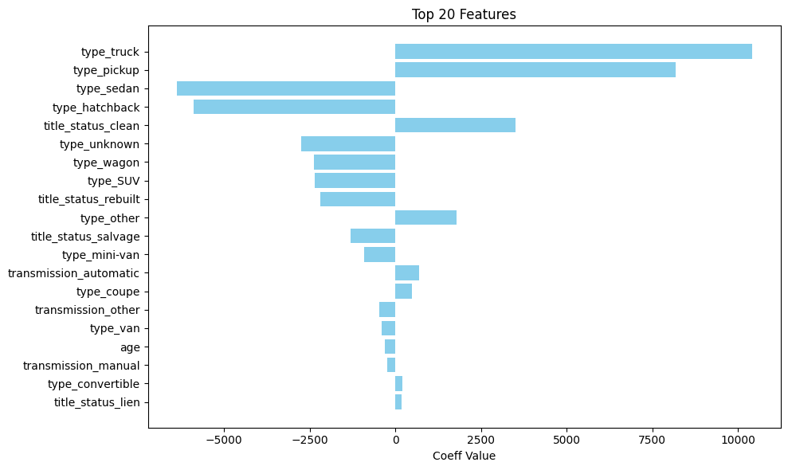
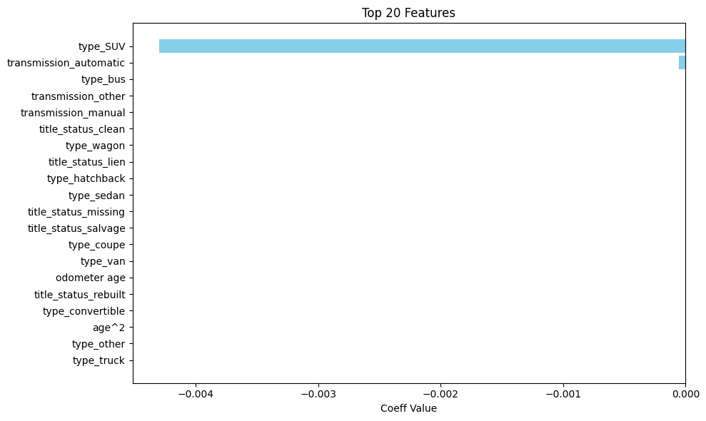

# Car Price Analysis

This repo contains the notebook that analyzes the [used car price data](./data/vehicles.csv) and attempts to determine the features that drive a car's price and hence what features are customers mostly interested in. 

The notebook is present in this [github repo](./prompt_II.ipynb) as well as on [Google Colab](https://colab.research.google.com/drive/1McPGLzaaBCiUN2Iw1WEtMW9V4ZwvuyT1?usp=sharing).

## Problem Statement (as provided in the notebook prompt)

In this application, you will explore a dataset from Kaggle. The original dataset contained information on 3 million used cars. The provided dataset contains information on 426K cars to ensure speed of processing. Your goal is to understand what factors make a car more or less expensive. As a result of your analysis, you should provide clear recommendations to your client -- a used car dealership -- as to what consumers value in a used car.

To frame the task, throughout our practical applications, we will refer back to a standard process in industry for data projects called CRISP-DM. This process provides a framework for working through a data problem. Your first step in this application will be to read through a brief overview of CRISP-DM [here](https://www.google.com/url?q=https%3A%2F%2Fmo-pcco.s3.us-east-1.amazonaws.com%2FBH-PCMLAI%2Fmodule_11%2Freadings_starter.zip). After reading the overview, answer the questions below.

## Technical Description

From a data perspective, this task involves developing a predictive model to estimate used car prices based on available vehicle attributes.
The goal is to:
- perform exploratory data analysis (EDA) to identify key features influencing car prices
- apply data preprocessing techniques to prepare the dataset
- and use statistical and machine learning models to quantify the impact of each feature

The goal is to derive actionable insights that explain variation in car prices and inform pricing strategies for the dealership.

## Steps

### Load and Preview the Data
- Let’s load the data and check the structure — including target variable (price) and potential predictors (e.g., year, mileage, make, model, condition, etc.).

#### Observations:
- Many rows are missing crucial info:
  - Over 1,000 rows have no data beyond id, region, price, and state
  - The target variable is price (and all rows have data).
  - Key features for predicting price include:
      - age, manufacturer, model, condition, cylinders, fuel, odometer, transmission, drive, type, etc.

### Exploratory Data Analysis/Data Cleaning/Feature Engineering

#### Remove duplicates and rows with missing or invalid values
- Create new features (e.g., car age = 2025 - year)

	| Attribute   | % NA   |
	|:------------|:-------|
	| condition   | 40.79% |
	| cylinders   | 41.62% |
	| VIN         | 37.73% |
	| drive       | 30.59% |
	| size        | 71.77% |
	| paint_color | 30.50% |

- Shape before dropping these columns: (426880, 18)
- Shape after dropping these columns: (426880, 11)

#### Remove outliers (e.g., prices < $500 or > $100,000)
- Example of analyzing odometer distribution:

	

	| Condition            | % rows |
	|:---------------------|:-------|
	| Price <= $500        | 10.10% |
	| Price >= $100k       | 0.16%  |
	| Odometer >= 250k     | 1.75%  |
	| Total Removable rows | 15.64% |

 - Shape after removing these outliers: (309646, 11)

#### Analyze correlation between features and price
- Columns that have weaker correlation beyond a threshold are eliminated
- Any correlation value such that -0.1 < x < 0.1 is eliminated

   
- Columns that are kept

	| Feature      | Correlation |
	|:-------------|:------------|
	| transmission | 0.21        |
	| type   	     | 0.10        |
	| title_status | -0.10       |
	| age       	  | -0.31       |
	| odometer     | -0.50       |

- Dropping columns with weaker correlation
  - ['model', 'manufacturer', 'fuel', 'state', 'region']
- Columns with too many categories are eliminated
- Shape after dropping weaker columns: (309646, 6)

 	| Column       | Non-Null Count | Dtype   |  
 	|:-------------|:---------------|:--------|
    | price        | 309646         | int64   |  
    | odometer     | 309646         | float64 |
    | title_status | 303922         | object  |
    | transmission | 308345         | object  |
    | type         | 249714         | object  |
    | age          | 308554         | float64 |
	
- `type` is the only col which has 250k non na rows while others are at 300k+
  - we dont want other imp rows to be dropped due to this. 
  - Lets add an `unknown` type to preserve the non-na row counts at 300k
- Shape after final clean up: (301819, 6)

### Modeling
- Use Linear Regression to get interpretable feature importance
- Use One Hot Encoding (OHE) for Categorical features
- Use (or not use) polynomials and see if that makes it better or worse

### Insights & Recommendations
- Plot test vs train; actual vs prediction
  - Polynomial One Hot Encoding
	
  - Linear One HOt Encoding
	

- Evaluate model performance using MSE

	| Model        | Train MSE      | Test MSE       |  
 	|:-------------|:---------------|:---------------|
    | Poly + OHE   | 151,882,536.67 | 149,935,314.73 |  
    | Linear + OHE | 118,055,469.90 | 116,606,015.11 |
	
- Look at the top features and their coefficients
  - Linear Coefficients
	
  - Polynomial Coefficients	
	

### Decide which model is better
- Neither of the models fares greatly in terms of predicted vs. actual data
- Test vs. Train fit, looks good
- The Linear model seems better since
  - its MSE is much less
  - the prediction seems better due to less negative price points
  - feature coeff are more uniformly distributed (much like the correlation matrix)

## Summary & Conclusion
Based on the above analysis, dealers should be focused on:
- Selling cars that have clean title (even those which are financed/in lien) and avoid salvage and rebuilt cars
- Trucks and Pickups have more value than sedan, hatchback, SUV, Wagon - aka family cars have less resale value compared to commercial cars
- Automatic transmission rather than manual 
- Age has very little impact on the resale value
- Odometer doesn't show up in the top 20 features
